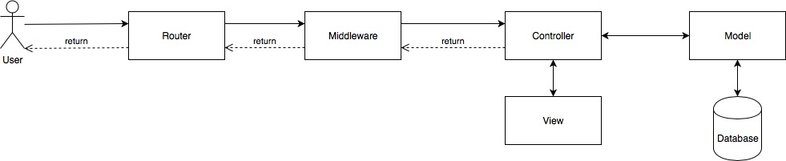

# High level architecture
Giving vision for software architecture

## Frameworks
- Back-end: 
    + Laravel 5.2
    + MySQL
- Front-end:
    + Bootstrap 4.1.3

### Installation
Because client use GoDaddy hosting and PHP 5.6. So, we choose [Laravel 5.2](https://laravel.com/docs/5.2) for this project.

**Note:** This setup for Mac OS

#### Install Homebrew
```bash
/usr/bin/ruby -e "$(curl -fsSL https://raw.githubusercontent.com/Homebrew/install/master/install)"
```

#### Install Composer
```bash
brew install composer
composer --version
```

#### Install PHP
```bash
brew install php72
php --version
```

#### Install Node.js
Go to [Node.js Homepage](https://nodejs.org/en/) and download **TLS version**

### Setup
```bash
composer create-project --prefer-dist laravel/laravel  name_of_project  "5.2.*"
cd  name_of_project 
mv .env.example .env
```

Replace content of `package.json` follow this
```json
{
  "private": true,
  "scripts": {
    "dev": "npm run development",
    "development": "cross-env NODE_ENV=development node_modules/webpack/bin/webpack.js --progress --hide-modules --config=node_modules/laravel-mix/setup/webpack.config.js",
    "watch": "npm run development -- --watch",
    "watch-poll": "npm run watch -- --watch-poll",
    "hot": "cross-env NODE_ENV=development node_modules/webpack-dev-server/bin/webpack-dev-server.js --inline --hot --config=node_modules/laravel-mix/setup/webpack.config.js",
    "prod": "npm run production",
    "production": "cross-env NODE_ENV=production node_modules/webpack/bin/webpack.js --no-progress --hide-modules --config=node_modules/laravel-mix/setup/webpack.config.js"
  },
  "devDependencies": {
    "axios": "^0.18.0",
    "bootstrap": "^4.1.3",
    "cross-env": "^5.2.0",
    "jquery": "^3.3.1",
    "laravel-mix": "^2.1.14",
    "lodash": "^4.17.11",
    "popper.js": "^1.14.4"
  },
  "dependencies": {
    "font-awesome": "^4.7.0"
  }
}
```

Install packages from `package.json`
```bash
npm install
```

Install packages from `composer.json`
```bash
composer install
```

Install SASS compiler
```bash
sudo npm install node-sass -g
```

Replace `resources/sass/_variables.scss`
```scss
// Body
$body-bg: #fff;

// Typography
$font-family-sans-serif: "Raleway", sans-serif;
$font-size-base: 0.9rem;
$line-height-base: 1.6;

$font-weight-light: 300;
$font-weight-regular: 400;
$font-weight-medium: 500;
$font-weight-semibold: 600;
$font-weight-bold: 700;

// Z-index
$zindex-dropdown:          1000 !default;
$zindex-sticky:            1020 !default;
$zindex-fixed:             1030 !default;
$zindex-modal-backdrop:    1040 !default;
$zindex-modal:             1050 !default;
$zindex-popover:           1060 !default;
$zindex-tooltip:           1070 !default;

// Grid breakpoints
$grid-breakpoints: (
  xs: 0,
  sm: 576px,
  md: 768px,
  lg: 992px,
  xl: 1200px
) !default;

// Colors
$blue: #3490dc;
$indigo: #6574cd;
$purple: #9561e2;
$pink: #f66D9b;
$red: #e3342f;
$orange: #f6993f;
$yellow: #ffed4a;
$green: #38c172;
$teal: #4dc0b5;
$cyan: #6cb2eb;

$ciz-green: #3E9723;
$ciz-yellow: #F1CC01;
$ciz-blue: #01C9F1;
$ciz-pink: #ED1566;
$ciz-brown: #5E3C17;

// Tempate
$theme-colors: (
  "green": $ciz-green,
  "pink": $ciz-pink,
  "blue": $ciz-blue,
  "yellow": $ciz-yellow,
  "brown": $ciz-brown
);
```

Replace `resources/sass/bootstrap.scss`
```scss
// Fonts
@import url('https://fonts.googleapis.com/css?family=Fredericka+the+Great|Raleway:300,400,500,600,700');

// Variables
@import 'variables';

// Bootstrap
@import '~bootstrap/scss/bootstrap';

// Font Awesome
@import "~font-awesome/scss/font-awesome.scss";
```

Create directory `resources/images`
```bash
mkdir -p resources/images
```

Create `webpack.mix.js`
```javascript
const mix = require('laravel-mix');

mix
    .copyDirectory('resources/images', 'public/img')

    .js('resources/js/bootstrap.js', 'public/js')

    .sass('resources/sass/bootstrap.scss', 'public/css')
;
```

## Architecture
Laravel uses MVC architecture (Model - View - Controller)



With MVC Architecture, you must focus on 4 points
- Router
- Controller
- View
- Model

## Folder Structure
I list some important directories
```
CampIzza
|___app
|   |___Http
|   |   |___Controllers
|   |   |___routes.php
|   |___User.php
|   |___Role.php
|___database
|   |___migrations
|   |___seeds
|___resources
|___|___js
|___|___sass
|___|___views
```
Explain it:

| Directory               | Description           |
| ----------------------- | --------------------- |
| app/Http/Controllers/   | Controller (m-v-C)    |
| app/Http/routes.php     | Router                |
| app/*.php               | Model (M-v-c)         |
| database/migrations     | Create table schema   |
| database/seeds          | Create sample data    |
| resources/              | View (m-V-c)          |

## Development
```bash
# Close Terminal after run
php artisan migrate:refresh --seed

# Open Terminal #1
php artisan serve

# Open Terminal #2
npm run watch
```

## UI Architecture
https://www.figma.com/file/MB5XMSTLJhHOJ90G9rJRngBg/CampIzza?node-id=0%3A1

## References
- https://laravel.com/docs/5.2
    + https://laravel.com/docs/5.2/migrations
    + https://laravel.com/docs/5.2/routing
    + https://laravel.com/docs/5.2/controllers
    + https://laravel.com/docs/5.2/blade
    + https://laravel.com/docs/5.2/eloquent
- https://laravel-mix.com/docs/2.1/installation
- https://sass-lang.com/guide
- https://getbootstrap.com/docs/4.1/getting-started/introduction/
    + https://getbootstrap.com/docs/4.1/layout/overview/
    + https://getbootstrap.com/docs/4.1/layout/grid/
    + https://getbootstrap.com/docs/4.1/utilities/flex/
    + https://getbootstrap.com/docs/4.1/utilities/text/
    + https://getbootstrap.com/docs/4.1/utilities/colors/
- https://www.creative-tim.com/product/argon-dashboard
