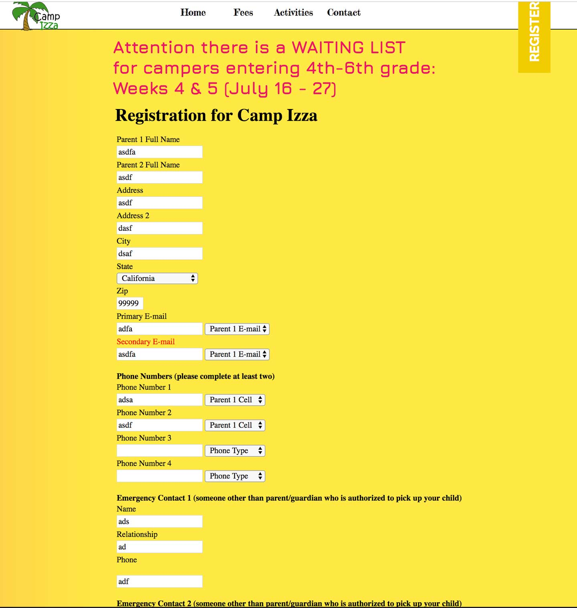
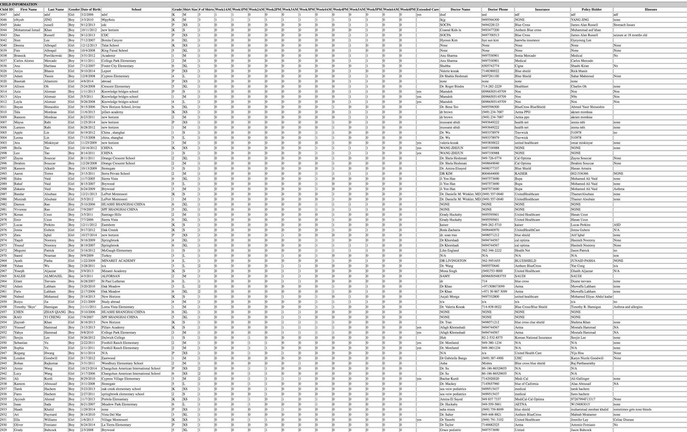

# Project vision
Giving project participants a reason for contributing. It clarifies the project's purpose, eliminates confusion, unifies the team, and inspires them to do their best.

## Overview
### Purpose
Gathering, analysis requirements for update version of Camp Izza. Document focus on what is stakeholders needs and reason for contributing. 
Project vision provides overview of project. Also, evolution in the future; including purpose, scope and problems.
After read this document, the stakeholders will have an overview and features of product.
### Audiences
- Customer
    - Organization: Camp Izza
    - Website: www.campizza.com
- Development team

## Problems
### Problem statements
Parents registers for their children on website. The camp owner, has to manually go in at night and fix his data points on excel. Additionally, users have a hard time adjusting their schedule after selecting if they want to be there for a full-day or half-day.

To see related images, you can visit links below:

### Solutions
To automate the data entry of the registration process, we will write a script that helps populate the data into other data sheets that our client must manually input at the moment. Additionally, we will take that same data and use software packages such as pandas or tableau to help visualize the data in a way that is comprehensible to our client. We will be sure to check and see if the infographics and charts, meets the needs of our client. We will then create a more dynamic registration form that is easier to follow by creating a design that flows with the current website tone.
### Benefits
Saving time and efforts when manage their summer camp.
### Scope
We are to design and create a registration system to help parents register their children in Camp Izza’s summer program and incorporate their roster into a digital/online attendance tracker. A summary of the needs include: automating the data entry of the registration process and roster, creating a dashboard for our client to understand attendance of staff and students, creating a visible registration process that can be easily edited, optimizing the ability to print out reports of the rosters, creating a smoother payment process that also allows people credit options if they need to cancel their order for attendance, and a system that automates and reminds users about upcoming dates. 
### Assumptions
- If a parent attempts to submit an incomplete child registration form, the system will display a message describing what is and how to correct it.
- Parent(s)/ staff will be notified of any changes made to a child file.
- Parent(s)/staff will make changes quickly once necessary
- Parent(s) will buy making accounts to register children
- The database will update any changes made by a parent/staff
- The database will handle duplicate registrations.
- The parent has all the following information about the children
    - Name
    - Age
    - Medical records
    - Payment information
    - Shirt size

## Product
### Stakeholders
- Summer camp managers: Who uses new system for automate the manual works.
- Parents: Registering for their kids participate in summer camp.
- Couselors: Managing the kids everyday during the camp.
### Related products
- CampDoc.com
- CampBrain.com
- CampMinder.com

### Timeline
- 10 weeks
- 5 Deliverables
### Final product
- Source code
- Production has been deployed
- Related documents
### Budget
- SECRET
- SECRET
- SECRET
### Development environment
- Programming language: PHP
- Database: MySQL
- Server use GoDady's service

## Features
- Employee account management
- Registration management
- Schedule management
- Analysing and Reporting
- Managing list of shirts, allergies, and extended care
- Payment with Paypal

## Conlustion
Through the above presentation about the features as well as the advantages of this software. We believe that this software will be built on time and function as described.
