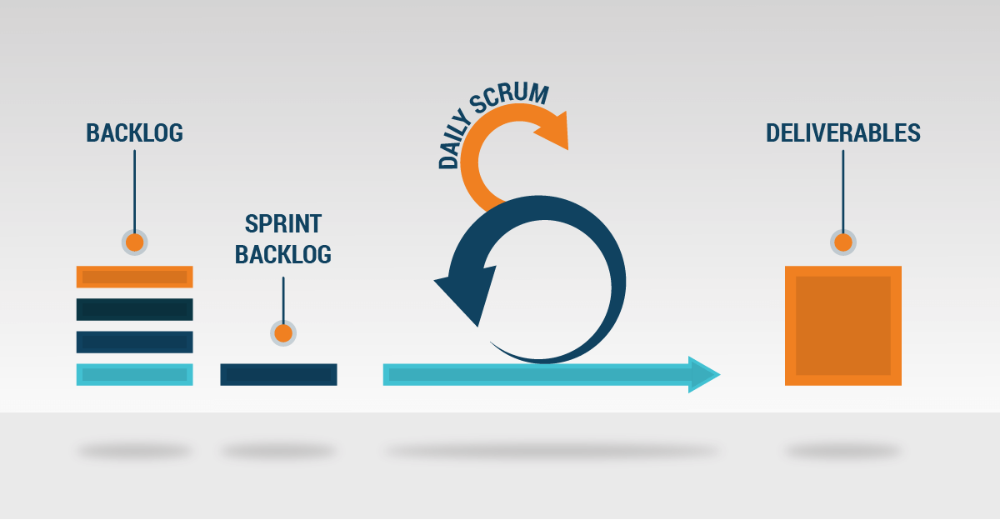

# Software process definition
Definition of the process used to develop this project

## Life cycle
Due to the short project duration, we needs a flexible method of managing the process. Therefore, we chose the Scrum methodology.

## Roles
- Product owner
    - Omar Ezzeldine
- Scrum master
    - Danie Le
- Development team
    - Kimberly Montenegro-Andrade 
    - Ayah Muhsin
    - Nick Lyu
    - Brian Nguyen 
- Technical advisor
    - Nam Vo

## Planning
### Timeline
- Start date: September 27, 2018
- End date: December 10 - 11, 2018
### Tasks
1. Preparing system
- Purpose:
    - Prepare tools for project management, quality assurance.
- The necessary documents:
    - Instruction documents
- Timeline:
    - Sep 27, 2018 - Nov 29, 2018
2. Write the necessary documentation
- Purpose:
    - Prepare related documentation for project management, quality assurance.
- The necessary documents:
    - Product backlog
    - Use cases
    - UI Mockups
    - High level architecture
- Duration:
    - Sep 27, 2018 - Nov 29, 2018
3. Build product
- Purpose:
    - Build product follows camp owner' requirements
- Timeline:
    - Nov 1, 2018 - Dec 10 - 11, 2018
### Timeline
#### Sprint #1
- Duration
    - Start date: Sep 27, 2018
    - End date: Oct 28, 2018
- Purpose
    - Gathering requirements
    - Preparing related documents
    - Design UI
    - Research technologies
- Tasks:
    1. Gathering requirements
        - Meeting customers
        - Discussing with sysadmin
    2. Preparing related documents
        - Project vision
        - High level architecture
        - Software process definition
        - User personas
    3. Design UI
        - Prototype
        - Mockup
    4. Research technologies
        - PayPal API guideline
        - PHP/Laravel - MySQL best practises
- Targets:
    - Documents
        - Use cases diagram
        - High level architecture
        - Software definition
    - UI Design
        - Log In
        - Sign Up
        - Register for Camp
    - Source code
        - GitHub repository
#### Sprint #2
- Duration
    - Start date: Oct 29, 2018
    - End date: Nov 18, 2018
- Purpose
    - Additional UI
    - Coding
- Tasks
    1. Convert old structure to new structure for database
    2. Implement UI design
    3. Coding
- Targets
    - UI Design
        - Children Management
        - Schedules Management
    - Implemented features
        - Log In
        - Sign up
        - Register for Camp
        - Schedules Management
#### Sprint #3
- Duration
    - Start date: Nov 19, 2018
    - End date: Dec i9, 2018
- Purpose
    - Coding
    - Deployment
- Tasks
    1. Deploy product on Camp Izza' server
    2. Update new database structure
- Targets
    - Release offical version

## Tools
- **GitHub** - Source controls
- **Microsoft Word/PowerPoint** - Writing document and presentation
- **Microsoft Excel** - Show customer' data
- **Google Drive** - Storing documents and resources
- **Visual Studio Code** - Text Editor
- **Draw.io** & **Visual Paradigm** - Draw diagrams
- **Figma** - Design tool
- **Nucleo** - Icon library
